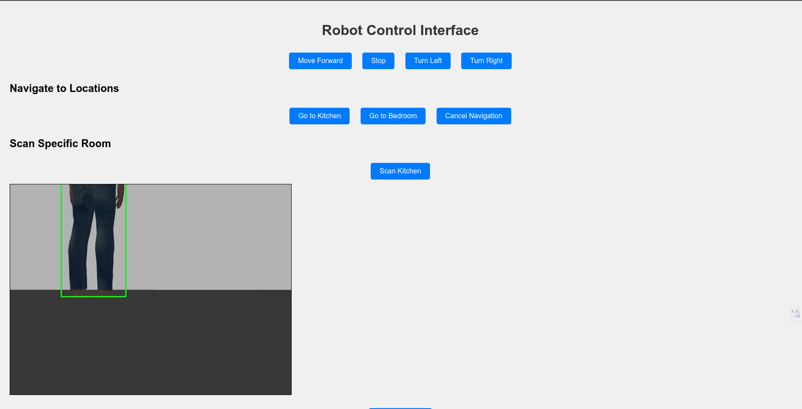
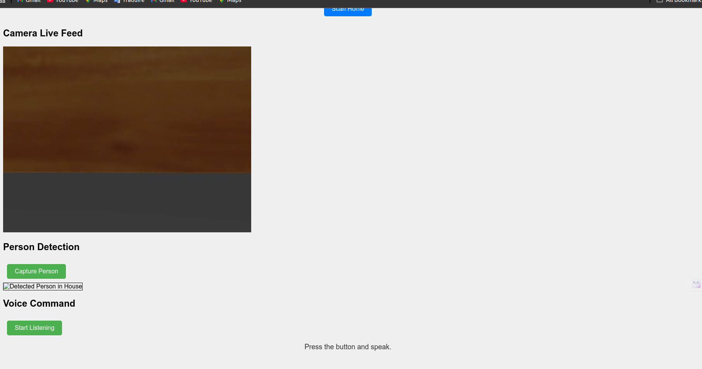
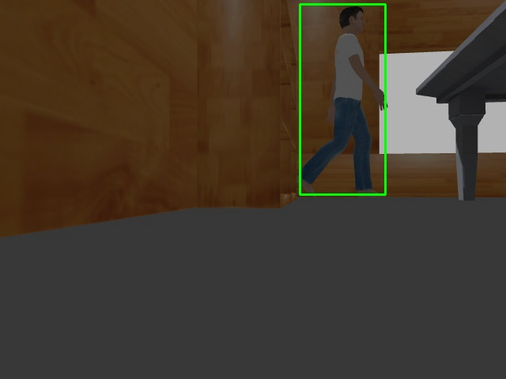
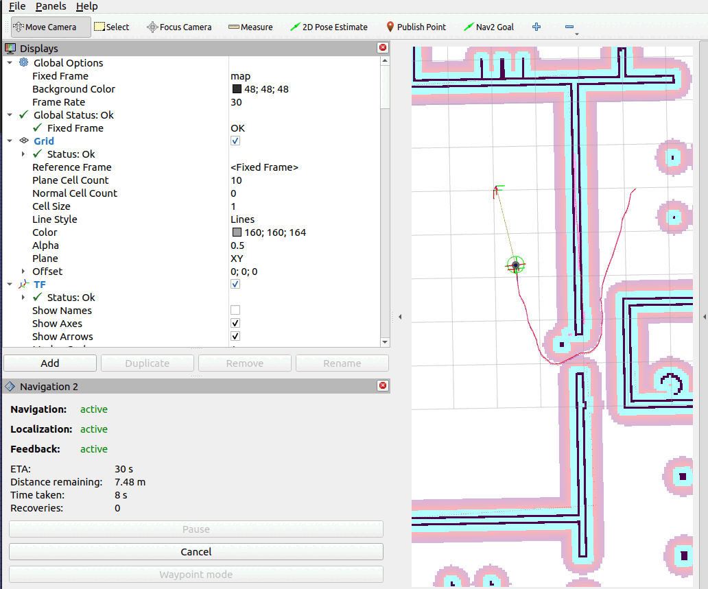

```markdown
# Smart Home Robot (ROS2)

## Overview

This project integrates ROS2, SLAM, Navigation, MQTT, YOLO, and Vosk to control a robot in a home environment. The robot can detect people, provide live camera feeds, and be controlled via voice commands or a web interface.

## Features

- **Autonomous Navigation:** Utilizes SLAM and Nav2 for house navigation.
- **YOLO Object Detection:** Detects and captures images of people.
- **Live Camera Feed:** Streams real-time video to the web interface.
- **MQTT Communication:** Manages robot commands and status updates.
- **Voice Control:** Implements Vosk for voice-based commands.
- **Web Interface:** Hosted on Netlify, accessible from any device.
- **Alert System:** Triggers vocal alerts upon detecting a person.

## Setup & Installation

### Prerequisites
- ROS2 Humble
- Gazebo (for simulation)
- Python 3
- Cloudflared or Ngrok (for hosting)
- Netlify (for web interface)

### 1️⃣ Clone the Project

```bash
cd ~/ros2_ws/src
git clone https://github.com/Ghayth-Bouzayeni/homerobot.git
```

### 2️⃣ Build the Package

```bash
cd ~/ros2_ws
colcon build
source install/setup.bash  # If build fails, try sourcing
```

### 3️⃣ Run MQTT Communication

Start MQTT Subscribers and Publishers:

```bash
ros2 run mqtt_communication command_subscriber
ros2 run mqtt_communication pose_publisher
```

### 4️⃣ Start SLAM & Navigation

```bash
ros2 launch robot_simulation house_slam.launch.py
ros2 launch robot_simulation autonomous_navigation.launch.py
```

### 5️⃣ Start Video Feed

```bash
ros2 run robot_simulation compressed_video_stream
```

### 6️⃣ Start Backend (Flask App)

```bash
python3 app.py
```

### 7️⃣ Get Links from Cloudflared/Ngrok

Run two terminals for public URLs:

```bash
cloudflared tunnel run
ngrok http 5000
```

Replace `localhost:5000` and `localhost:8080` in `index.html` with the provided links.

### 8️⃣ Host Web Interface on Netlify

Upload `index.html` to Netlify to access it from any device.

## How It Works

- **Move Robot:** Use buttons or voice commands (forward, left, right).
- **Scan Rooms:** Issue commands like "Scan Kitchen", "Scan Home", etc.
- **Detect Person:** The robot scans the environment and returns an image if a person is detected.
- **Live Camera Feed:** Real-time streaming on the web interface.
- **Voice Alerts:** If a person is found, an alert is triggered.

## Example Images
### Robot Interface





### Person Detection


### Nav and Slam



## License

This project is licensed under the Apache License 2.0.

## Contact

For any questions, reach out to: Ghayth Bouzayeni (ghayth@todo.todo)

