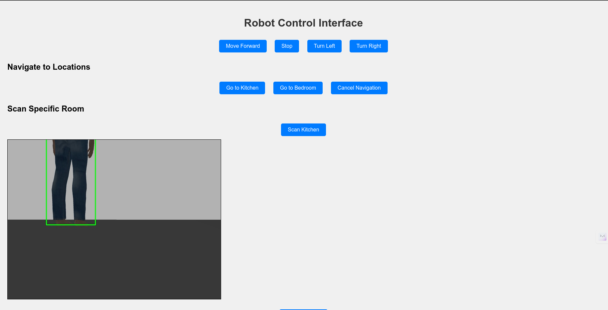
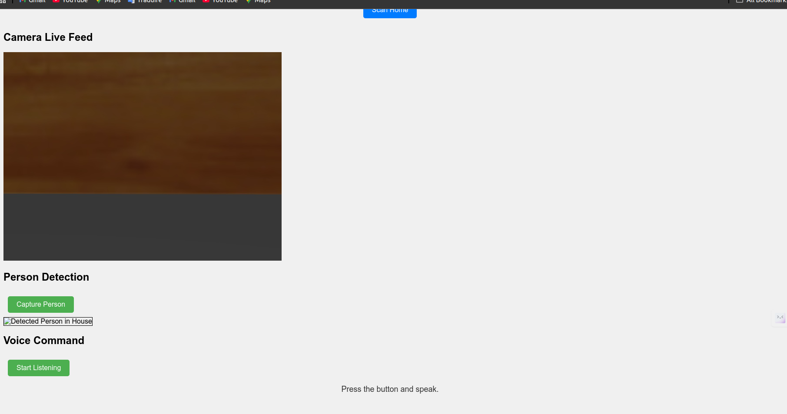
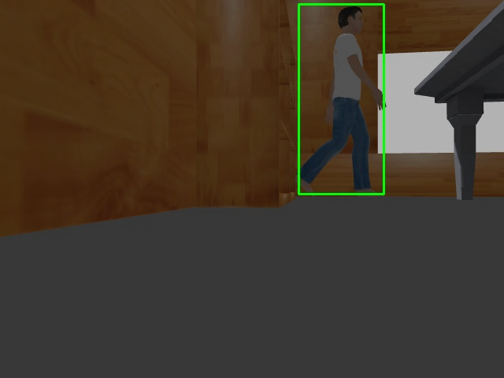
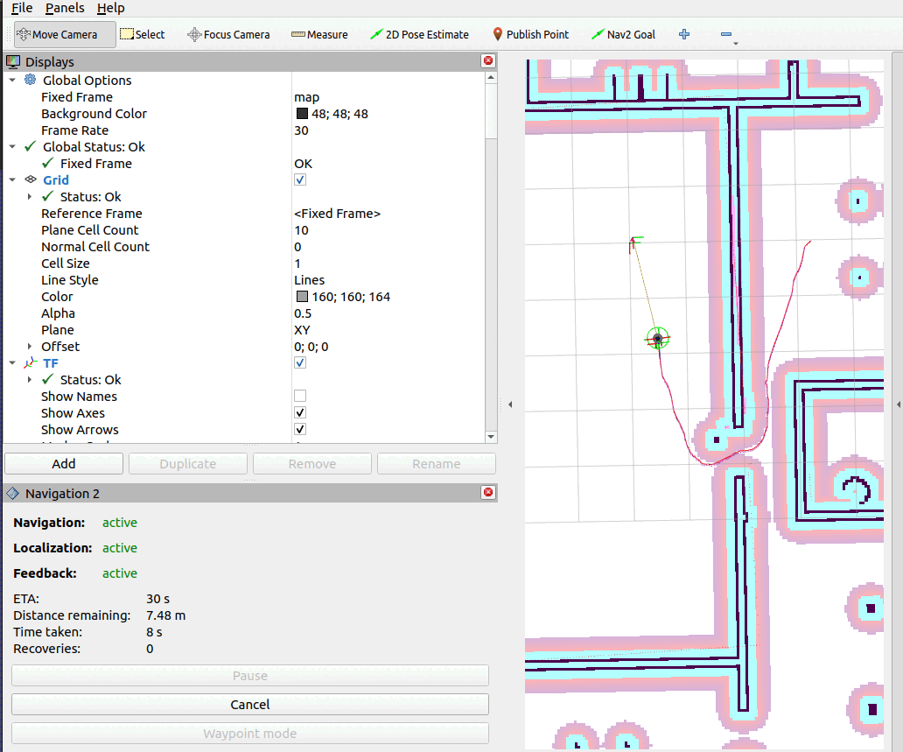

```markdown
# Smart Home Robot (ROS2)

## Overview

This project integrates ROS2, SLAM, Navigation, MQTT, YOLO, and Vosk to control a robot in a home environment. The robot can detect people, provide live camera feeds, and be controlled via voice commands or a web interface.

## Features

- **Autonomous Navigation:** Utilizes SLAM and Nav2 for house navigation.
- **YOLO Object Detection:** Detects and captures images of people.
- **Live Camera Feed:** Streams real-time video to the web interface.
- **MQTT Communication:** Manages robot commands and status updates.
- **Voice Control:** Implements Vosk for voice-based commands.
- **Web Interface:** Hosted on Netlify, accessible from any device.
- **Alert System:** Triggers vocal alerts upon detecting a person.

## Setup & Installation

### Prerequisites
- ROS2 Humble
- Gazebo (for simulation)
- Python 3
- Cloudflared or Ngrok (for hosting)
- Netlify (for web interface)

### 1️⃣ Clone the Project

```bash
cd ~/ros2_ws/src
git clone https://github.com/Ghayth-Bouzayeni/homerobot.git
```

### 2️⃣ Build the Package

```bash
cd ~/ros2_ws
colcon build
source install/setup.bash  # If build fails, try sourcing
```

### 3️⃣ Download YOLOv4 Weights

Due to the large size of the YOLOv4 weights, they are not included in this repository. You must manually download the YOLOv4 weights and place them in the `/yolo` directory.

1. Download YOLOv4 weights from [here](https://github.com/AlexeyAB/darknet/releases/download/yolov4/yolov4.weights).
2. Move the `yolov4.weights` file to the `/yolo` folder in the project directory.

### 4️⃣ Run MQTT Communication

Start MQTT Subscribers and Publishers:

```bash
ros2 run mqtt_communication command_subscriber
ros2 run mqtt_communication pose_publisher
```

### 5️⃣ Start SLAM & Navigation

```bash
ros2 launch robot_simulation house_slam.launch.py
ros2 launch robot_simulation autonomous_navigation.launch.py
```

### 6️⃣ Start Video Feed

```bash
ros2 run robot_simulation compressed_video_stream
```

### 7️⃣ Start Backend (Flask App)

```bash
python3 app.py
```

### 8️⃣ Get Links from Cloudflared/Ngrok

Run two terminals for public URLs:

```bash
cloudflared tunnel run
ngrok http 5000
```

Replace `localhost:5000` and `localhost:8080` in `index.html` with the provided links.

### 9️⃣ Host Web Interface on Netlify

Upload `index.html` to Netlify to access it from any device.
## DevOps Approach

This project uses a DevOps approach to ensure scalability, automation, and easy deployment:

### ✅ CI/CD Pipeline with GitHub Actions

- **Automated Builds and Tests**: Set up a CI pipeline that automatically builds and tests all services (ROS2 + Gazebo, backend, frontend) when changes are pushed.
- **Unit Testing in Docker**: Unit tests are run inside Docker containers, ensuring consistent environments across different stages.
- **Automated Docker Image Deployment**: Docker images are automatically built and pushed to Docker Hub after successful tests, allowing for easy deployment and scaling.

### 🔧 Dockerized ROS2 + Gazebo Simulation with Docker Compose

- **Orchestrating Services with Docker Compose**: Docker Compose is used to manage the robot’s services in isolated containers. This makes it easy to scale, replicate, and extend the system.
- **Portable and Easy Deployment**: All services (frontend, backend, ROS2 + Gazebo simulation, and MQTT broker) are containerized, making them portable and ready for deployment on any platform.

### 📡 MQTT for Inter-Service Communication

- **Efficient Communication**: MQTT is used as the communication protocol between the frontend, backend, and ROS2 simulation, ensuring low-latency and reliable messaging between services.

### 🧠 Modular Architecture

- **Containerized Services**: Each component (frontend, backend, ROS2 simulation, MQTT broker) is containerized and can be tested independently, making it easier to maintain and scale.
- **Backend-Robot Interaction**: The backend communicates with ROS nodes to trigger robot actions via MQTT, ensuring seamless integration of the system.

### 📦 Docker Images Published

- All components, including the MQTT broker, are containerized and pushed to Docker Hub. This makes it easier to deploy the project across multiple environments.

### 🎯 Why This Matters

This project is more than just a simulation; it’s built with a software engineering mindset: scalable, reproducible, and automated. The DevOps practices ensure the project can be easily extended, deployed, and maintained.

### 🚀 Future Steps

The next step is to deploy the project to a live VPS for continuous delivery (CD), ensuring real-time updates and seamless scaling.


## How It Works

- **Move Robot:** Use buttons or voice commands (forward, left, right).
- **Scan Rooms:** Issue commands like "Scan Kitchen", "Scan Home", etc.
- **Detect Person:** The robot scans the environment and returns an image if a person is detected.
- **Live Camera Feed:** Real-time streaming on the web interface.
- **Voice Alerts:** If a person is found, an alert is triggered.

## Example Images

### Robot Interface




### Person Detection


### Nav and Slam


## License

This project is licensed under the Apache License 2.0.

## Contact

For any questions, reach out to: Ghayth Bouzayeni (ghayth@todo.todo)
```
